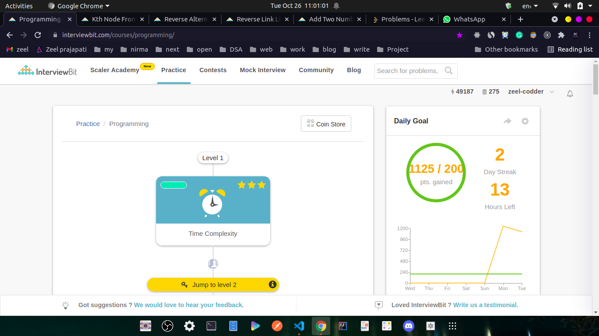

# Day67/100

Today I solved 4 medium level Coding problems on #interviewbit.

Problem 1:https://www.interviewbit.com/problems/kth-node-from-middle/

Problem 2:https://www.interviewbit.com/problems/reverse-alternate-k-nodes/

Problem 3:https://www.interviewbit.com/problems/reverse-link-list-ii/

Problem 4:https://www.interviewbit.com/problems/add-two-numbers-as-lists/

#100DaysOfCode
